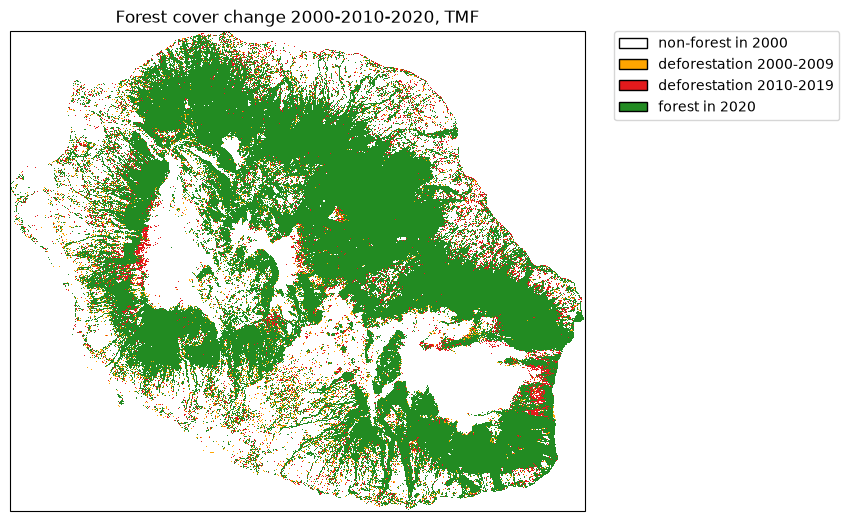
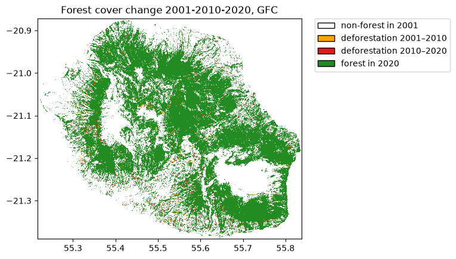
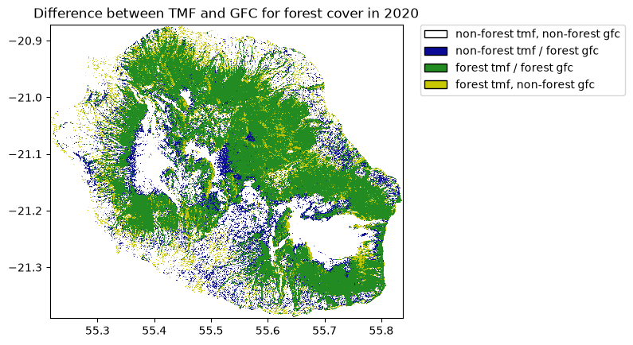
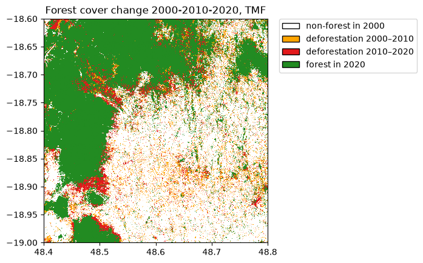

#+title: Get started
#+options: toc:nil title:t num:nil author:nil ^:{}
#+property: header-args:python :results output :session :exports both
#+property: header-args :eval never-export
#+export_select_tags: export
#+export_exclude_tags: noexport

* Get forest cover change from TMF
:PROPERTIES:
:CUSTOM_ID: get-forest-cover-change-from-tmf
:END:
The function =.get_fcc_loss()= can be used to download forest cover change
from the Tropical Moist Forest product. We will use the Reunion Island
(isocode "REU") as a case study.

#+begin_src python
from pathlib import Path

import ee
import geefcc
import rioxarray
#+end_src

#+RESULTS:

#+begin_src python
# Initialize GEE
ee.Initialize(project="deforisk", opt_url="https://earthengine-highvolume.googleapis.com")
#+end_src

#+RESULTS:

#+begin_src python
# Download data from GEE
out_dir = Path("out_tmf")
forest_file = out_dir / "forest_tmf.tif"
if not forest_file.is_file():
    geefcc.get_fcc_loss(
        aoi="REU",
        years=[2000, 2010, 2020],
        source="tmf",
        parallel=False,
        crop_to_aoi=True,
        tile_size=0.5,
        output_file=forest_file,
    )
#+end_src

#+RESULTS:
: get_fcc running, 3 tiles ....

We transform the forest raster with three bands into a single-band forest cover change raster.

#+begin_src python :results none
fcc_file = out_dir / "fcc_tmf.tif"
if not fcc_file.is_file():
    geefcc.sum_raster_bands(
        input_file=forest_file,
        output_file=fcc_file,
        verbose=False,
    )
#+end_src

We plot the forest cover change map.

#+begin_src python :results none
# Plot
years = [2000, 2010, 2020]
geefcc.plot_fcc_loss(
    input_file=fcc_file,
    years=years,
    output_file="tmf.png",
    title="Forest cover change 2000-2010-2020, TMF",
    dpi=100,
)
#+end_src

#+attr_rst: :width 800 :align center

* Compare with forest cover change from GFC
:PROPERTIES:
:CUSTOM_ID: compare-with-forest-cover-change-from-gfc
:END:

#+begin_src python
# Get data from GEE
out_dir = Path("out_gfc_50")
forest_file = out_dir / "forest_gfc_50.tif"
if not forest_file.is_file():
    geefcc.get_fcc_loss(
        aoi="REU",
        years=[2001, 2010, 2020],  # Here, first year must be 2001 (1st Jan)
        source="gfc",
        perc=50,
        parallel=False,
        crop_to_aoi=True,
        tile_size=0.5,
        output_file=forest_file,
    )
#+end_src

#+RESULTS:
: get_fcc running, 3 tiles ....

#+begin_src python :results none
# Sum bands to get a single-band fcc raster
fcc_file = out_dir / "fcc_gfc_50.tif"
if not fcc_file.is_file():
    geefcc.sum_raster_bands(
        input_file=forest_file,
        output_file=fcc_file,
        verbose=False,
    )
#+end_src

#+begin_src python :results none
# Plot
years_gfc = [2001, 2010, 2020]
geefcc.plot_fcc_loss(
    input_file=fcc_file,
    years=years_gfc,
    output_file="gfc.png",
    title="Forest cover change 2001-2010-2020, GFC",
    dpi=100,
)
#+end_src

#+attr_rst: :width 800 :align center

* Comparing forest cover in 2020 between TMF and GFC
:PROPERTIES:
:CUSTOM_ID: comparing-forest-cover-in-2020-between-tmf-and-gfc
:END:

#+begin_src python
import matplotlib.patches as mpatches
import matplotlib.pyplot as plt
from matplotlib.colors import ListedColormap

# Computing difference and sum
forest_tmf = rioxarray.open_rasterio(Path("out_tmf") / "forest_tmf.tif").astype("int")
forest_gfc = rioxarray.open_rasterio(Path("out_gfc_50") / "forest_gfc_50.tif").astype("int")
forest_diff = forest_tmf.sel(band=3) - forest_gfc.sel(band=3)
forest_sum = forest_tmf.sel(band=3) + forest_gfc.sel(band=3)
forest_diff = forest_diff.where(forest_sum != 0, -2)
#+end_src

#+RESULTS:

#+begin_src python :results none
# Colors
cols=[(10, 10, 150, 255), (34, 139, 34, 255), (200, 200, 0, 255)]
colors = [(1, 1, 1, 0)]  # transparent white for -2
cmax = 255.0
for col in cols:
    col_class = tuple([i / cmax for i in col])
    colors.append(col_class)
color_map = ListedColormap(colors)

# Labels
labels = {0: "non-forest tmf, non-forest gfc", 1: "non-forest tmf / forest gfc",
          2: "forest tmf / forest gfc", 3: "forest tmf, non-forest gfc"}
patches = [mpatches.Patch(facecolor=col, edgecolor="black",
                          label=labels[i]) for (i, col) in enumerate(colors)]

# Plot
fig = plt.figure()
ax = plt.subplot(111)
ds = forest_diff.squeeze()
nrow, ncol = ds.shape
xmin = float(ds.x.min())
xmax = float(ds.x.max())
ymin = float(ds.y.min())
ymax = float(ds.y.max())
xres = (xmax - xmin) / (ncol - 1)
yres = (ymax - ymin) / (nrow - 1)
extent = [xmin - xres / 2, xmax + xres / 2,
          ymin - yres / 2, ymax + yres / 2]
ax.imshow(ds.values, cmap=color_map, extent=extent, resample=False)
ax.set_aspect("equal")
plt.title("Difference between TMF and GFC for forest cover in 2020")
plt.legend(handles=patches, bbox_to_anchor=(1.05, 1), loc=2, borderaxespad=0.)
fig.savefig("comp.png", bbox_inches="tight", dpi=100)
plt.close(fig)
#+end_src

#+attr_rst: :width 800 :align center

Differences are quite important between the two data-sets. This might
change depending on the tree cover threshold we select for defining
forest with the GFC dataset.

* Download data from an extent
:PROPERTIES:
:CUSTOM_ID: download-data-from-an-extent
:END:

We will use the following extent which corresponds to a region around
the Analamazaotra special reserve in Madagascar.

#+begin_src python
out_dir = Path("out_tmf_extent")
forest_file = out_dir / "forest_tmf_extent.tif"
if not forest_file.is_file():
    geefcc.get_fcc_loss(
        aoi=(48.4, -19.0, 48.6, -18.8),
        years=[2000, 2010, 2020],
        source="tmf",
        tile_size=0.2,
        output_file=forest_file,
    )
#+end_src

#+RESULTS:
: get_fcc running, 4 tiles .....

#+begin_src python :results none
# Sum bands to get a single-band fcc raster
fcc_file = out_dir / "fcc_tmf_extent.tif"
if not fcc_file.is_file():
    geefcc.sum_raster_bands(
        input_file=forest_file,
        output_file=fcc_file,
        verbose=False,
    )
#+end_src

#+begin_src python :results none
# Plot
geefcc.plot_fcc_loss(
    input_file=fcc_file,
    years=[2000, 2010, 2020],
    output_file="extent.png",
    title="Forest cover change 2000-2010-2020, TMF",
    dpi=100,
)
#+end_src

#+attr_rst: :width 700 :align center

# End Of File
