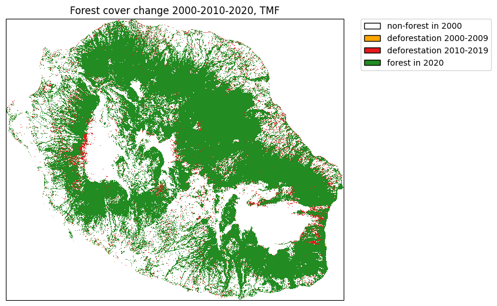
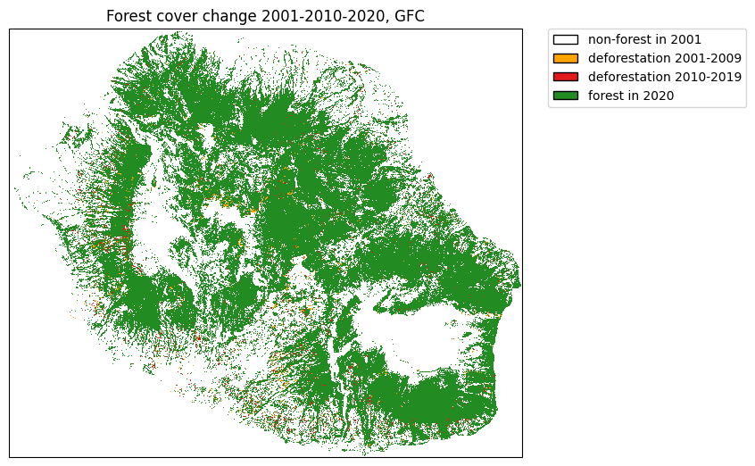
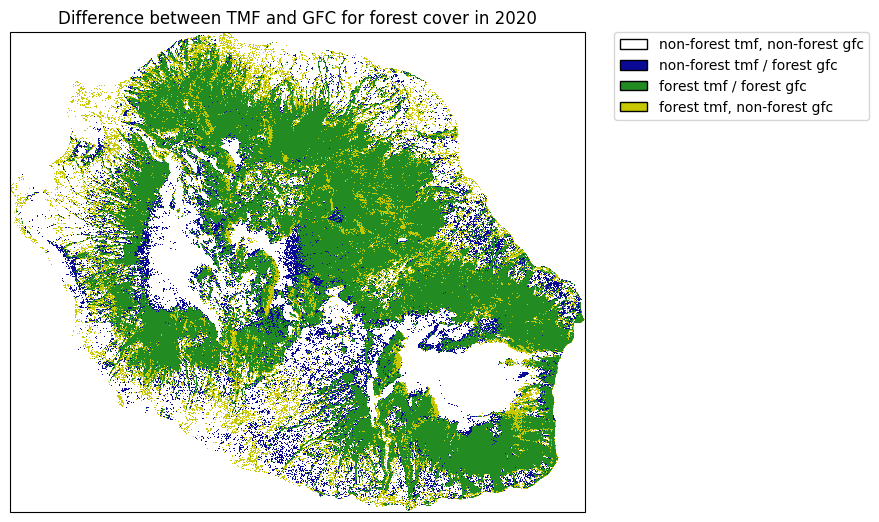
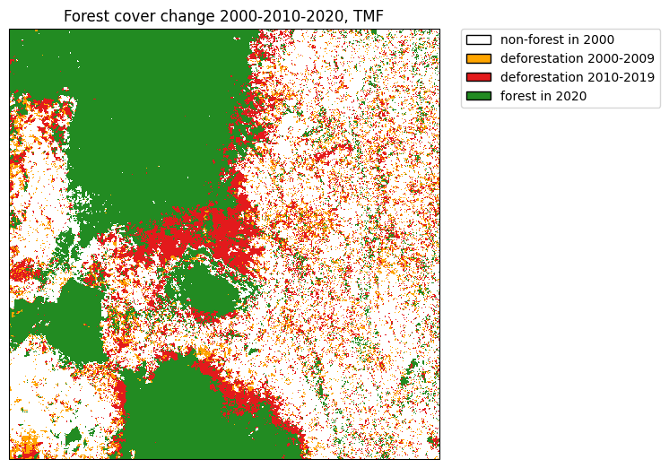

===========
Get started
===========

.. _get-forest-cover-change-from-tmf:

Get forest cover change from TMF
--------------------------------

The function ``.get_fcc()`` can be used to download forest cover change
from the Tropical Moist Forest product. We will use the Reunion Island
(isocode “REU”) as a case study.

.. code:: python

    import os

    import ee
    import geefcc
    import matplotlib.pyplot as plt
    from matplotlib.colors import ListedColormap
    import matplotlib.patches as mpatches
    import cartopy.crs as ccrs
    import rioxarray

.. code:: python

    # Initialize GEE
    ee.Initialize(project="forestatrisk", opt_url="https://earthengine-highvolume.googleapis.com")

.. code:: python

    # Download data from GEE
    if not os.path.isfile("out_tmf/forest_tmf.tif"):
        geefcc.get_fcc(
            aoi="REU",
            years=[2000, 2010, 2020],
            source="tmf",
            parallel=False,
            crop_to_aoi=True,
            tile_size=0.5,
            output_file="out_tmf/forest_tmf.tif",
        )

::

    get_fcc running, 3 tiles ....

.. code:: python

    # Load data
    forest_tmf = rioxarray.open_rasterio("out_tmf/forest_tmf.tif")
    forest_tmf

::

    <xarray.DataArray (band: 3, y: 1923, x: 2305)> Size: 13MB
    [13297545 values with dtype=int8]
    Coordinates:
      * band         (band) int64 24B 1 2 3
      * x            (x) float64 18kB 55.22 55.22 55.22 55.22 ... 55.84 55.84 55.84
      * y            (y) float64 15kB -20.87 -20.87 -20.87 ... -21.39 -21.39 -21.39
        spatial_ref  int64 8B 0
    Attributes:
        AREA_OR_POINT:  Area
        scale_factor:   1.0
        add_offset:     0.0

.. code:: python

    # Computing the sum
    fcc_tmf = forest_tmf.sum(dim="band")
    fcc_tmf

::

    <xarray.DataArray (y: 1923, x: 2305)> Size: 35MB
    array([[0, 0, 0, ..., 0, 0, 0],
           [0, 0, 0, ..., 0, 0, 0],
           [0, 0, 0, ..., 0, 0, 0],
           ...,
           [0, 0, 0, ..., 0, 0, 0],
           [0, 0, 0, ..., 0, 0, 0],
           [0, 0, 0, ..., 0, 0, 0]])
    Coordinates:
      * x            (x) float64 18kB 55.22 55.22 55.22 55.22 ... 55.84 55.84 55.84
      * y            (y) float64 15kB -20.87 -20.87 -20.87 ... -21.39 -21.39 -21.39
        spatial_ref  int64 8B 0

.. code:: python

    # Colors
    cols=[(255, 165, 0, 255), (227, 26, 28, 255), (34, 139, 34, 255)]
    colors = [(1, 1, 1, 0)]  # transparent white for 0
    cmax = 255.0  # float for division
    for col in cols:
        col_class = tuple([i / cmax for i in col])
        colors.append(col_class)
    color_map = ListedColormap(colors)

    # Labels
    labels = {0: "non-forest in 2000", 1:"deforestation 2000-2009",
              2:"deforestation 2010-2019", 3:"forest in 2020"}
    patches = [mpatches.Patch(facecolor=col, edgecolor="black",
                              label=labels[i]) for (i, col) in enumerate(colors)]

.. code:: python

    # Plot
    fig = plt.figure()
    ax = fig.add_axes([0, 0, 1, 1], projection=ccrs.PlateCarree())
    raster_image = fcc_tmf.plot(ax=ax, cmap=color_map, add_colorbar=False)
    plt.title("Forest cover change 2000-2010-2020, TMF")
    plt.legend(handles=patches, bbox_to_anchor=(1.05, 1), loc=2, borderaxespad=0.)
    fig.savefig("tmf.png", bbox_inches="tight", dpi=100)

.. _compare-with-forest-cover-change-from-gfc:

Compare with forest cover change from GFC
-----------------------------------------

.. code:: python

    # Get data from GEE
    if not os.path.isfile("out_gfc_50/forest_gfc_50.tif"):
        geefcc.get_fcc(
            aoi="REU",
            years=[2001, 2010, 2020],  # Here, first year must be 2001 (1st Jan)
            source="gfc",
            perc=50,
            parallel=False,
            crop_to_aoi=True,
            tile_size=0.5,
            output_file="out_gfc_50/forest_gfc_50.tif",
        )

::

    get_fcc running, 3 tiles ....

.. code:: python

    # Load data
    forest_gfc = rioxarray.open_rasterio("out_gfc_50/forest_gfc_50.tif")
    fcc_gfc = forest_gfc.sum(dim="band")

.. code:: python

    # Plot
    fig = plt.figure()
    ax = fig.add_axes([0, 0, 1, 1], projection=ccrs.PlateCarree())
    raster_image = fcc_gfc.plot(ax=ax, cmap=color_map, add_colorbar=False)
    plt.title("Forest cover change 2001-2010-2020, GFC")
    labels = {0: "non-forest in 2001", 1:"deforestation 2001-2009",
              2:"deforestation 2010-2019", 3:"forest in 2020"}
    patches = [mpatches.Patch(facecolor=col, edgecolor="black",
                              label=labels[i]) for (i, col) in enumerate(colors)]
    plt.legend(handles=patches, bbox_to_anchor=(1.05, 1), loc=2, borderaxespad=0.)
    fig.savefig("gfc.png", bbox_inches="tight", dpi=100)

.. _comparing-forest-cover-in-2020-between-tmf-and-gfc:

Comparing forest cover in 2020 between TMF and GFC
--------------------------------------------------

.. code:: python

    # Computing difference and sum
    forest_diff = forest_tmf.sel(band=3) - forest_gfc.sel(band=3)
    forest_sum = forest_tmf.sel(band=3) + forest_gfc.sel(band=3)
    forest_diff = forest_diff.where(forest_sum != 0, -2)

.. code:: python

    # Colors
    cols=[(10, 10, 150, 255), (34, 139, 34, 255), (200, 200, 0, 255)]
    colors = [(1, 1, 1, 0)]  # transparent white for -2
    cmax = 255.0  # float for division
    for col in cols:
        col_class = tuple([i / cmax for i in col])
        colors.append(col_class)
    color_map = ListedColormap(colors)

.. code:: python

    # Labels
    labels = {0: "non-forest tmf, non-forest gfc", 1:"non-forest tmf / forest gfc",
              2:"forest tmf / forest gfc", 3:"forest tmf, non-forest gfc"}
    patches = [mpatches.Patch(facecolor=col, edgecolor="black",
                             label=labels[i]) for (i, col) in enumerate(colors)]

.. code:: python

    # Plot
    fig = plt.figure()
    ax = fig.add_axes([0, 0, 1, 1], projection=ccrs.PlateCarree())
    raster_image = forest_diff.plot(ax=ax, cmap=color_map, add_colorbar=False)
    plt.title("Difference between TMF and GFC for forest cover in 2020")
    plt.legend(handles=patches, bbox_to_anchor=(1.05, 1), loc=2, borderaxespad=0.)
    fig.savefig("comp.png", bbox_inches="tight", dpi=100)

Differences are quite important between the two data-sets. This might
change depending on the tree cover threshold (here = 75%) we select for
defining forest with the GFC dataset.

.. _download-data-from-an-extent:

Download data from an extent
----------------------------

We will use the following extent which corresponds to a region around
the Analamazaotra special reserve in Madagascar.

.. code:: python

    if not os.path.isfile("out_tmf_extent/forest_tmf_extent.tif"):
        geefcc.get_fcc(
            aoi=(48.4, -19.0, 48.6, -18.8),
            years=[2000, 2010, 2020],
            source="tmf",
            tile_size=0.2,
            output_file="out_tmf_extent/forest_tmf_extent.tif",
        )

.. code:: python

    # Load data
    forest_tmf_mdg = rioxarray.open_rasterio("out_tmf_extent/forest_tmf_extent.tif")
    fcc_tmf_mdg = forest_tmf_mdg.sum(dim="band")

.. code:: python

    # Colors
    cols=[(255, 165, 0, 255), (227, 26, 28, 255), (34, 139, 34, 255)]
    colors = [(1, 1, 1, 0)]  # transparent white for 0
    cmax = 255.0  # float for division
    for col in cols:
        col_class = tuple([i / cmax for i in col])
        colors.append(col_class)
    color_map = ListedColormap(colors)

    # Labels
    labels = {0: "non-forest in 2000", 1:"deforestation 2000-2009",
              2:"deforestation 2010-2019", 3:"forest in 2020"}
    patches =[mpatches.Patch(facecolor=col, edgecolor="black",
                             label=labels[i]) for (i, col) in enumerate(colors)]

.. code:: python

    # Plot
    fig = plt.figure()
    ax = fig.add_axes([0, 0, 1, 1], projection=ccrs.PlateCarree())
    raster_image = fcc_tmf_mdg.plot(ax=ax, cmap=color_map, add_colorbar=False)
    plt.title("Forest cover change 2000-2010-2020, TMF")
    plt.legend(handles=patches, bbox_to_anchor=(1.05, 1), loc=2, borderaxespad=0.)
    fig.savefig("extent.png", bbox_inches="tight", dpi=100)

