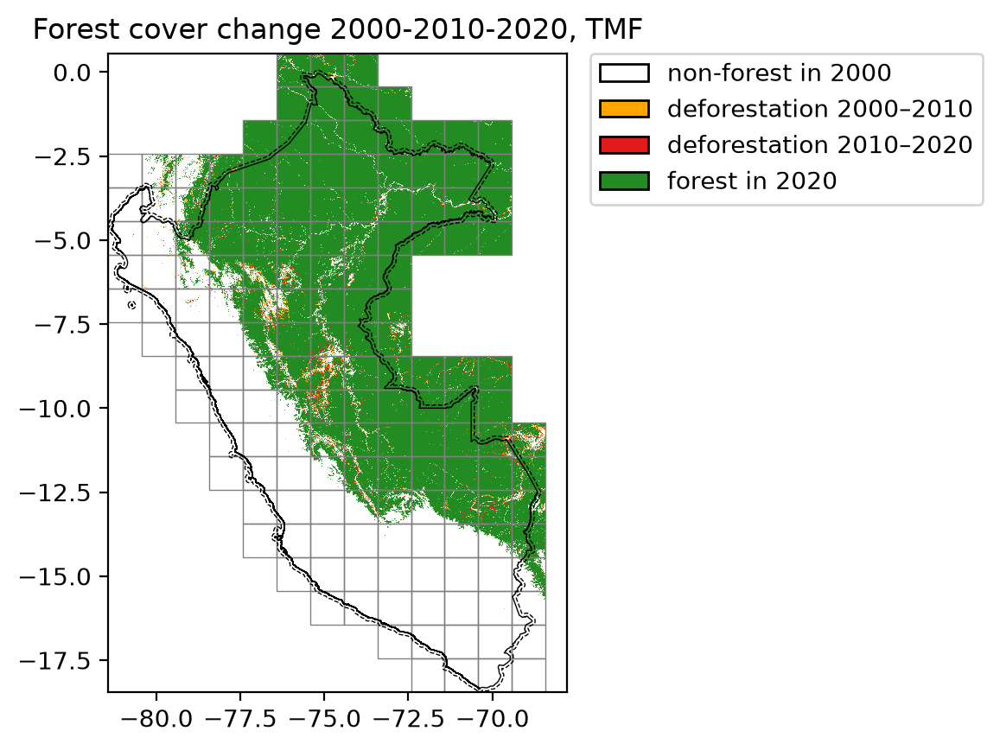

===============
Large countries
===============

Download the data from GEE
--------------------------

We can use ``geefcc`` to download forest cover change for large countries,
for example Perou (iso code “PER”). The country will be divided into
several tiles which are processed in parallel. If your computer has n
cores, n-1 cores will be used in parallel.

.. code:: python

    import os
    from pathlib import Path
    import time

    import ee
    import geefcc

We initialize Google Earth Engine.

.. code:: python

    # Initialize GEE
    ee.Initialize(project="deforisk",
                  opt_url=("https://earthengine-highvolume."
                           "googleapis.com"))

We can compute the number of cores used for the computation.

.. code:: python

    ncpu = os.cpu_count() - 1
    ncpu

::

    7

We download the forest cover change data from GEE for Peru for years 2000, 2010 and 2020, using a buffer of about 10 km around the border (0.089... decimal degrees) and a tile size of one degree.

A buffer can be useful if we want to avoid “edge effects”, while computing distance to forest edge for example. One degree tiles are used to download the data from GEE in parallel.

.. code:: python

    out_dir = Path("out_tmf")
    ofile = out_dir / "forest_tmf.tif"
    years = [2000, 2010, 2020]

    start_time = time.time()
    geefcc.get_fcc_loss(
        aoi="PER",
        buff=0.08983152841195216,
        years=years,
        source="tmf",
        tile_size=1,
        output_file=ofile,
        parallel=True,
        ncpu=ncpu,
    )
    end_time = time.time()

::

    get_fcc running, 159 tiles ...

We estimate the computation time to download 159 1-degree tiles using several cores.

.. code:: python

    elapsed_time = (end_time - start_time) / 60
    print('Execution time:', round(elapsed_time, 2), 'minutes')

::

    Execution time: 8.97 minutes

Transform multiband fcc raster in one band raster
-------------------------------------------------

We transform the data to have only one band describing the forest cover change with 0 for non-forest, 1 for deforestation on the period 2000--2009, 2 for deforestation on the period 2010--2019, and 3 for the remaining forest in 2020. To do so, we just sum the values of the raster bands.

.. code:: python

    fcc_file = out_dir / "fcc_tmf.tif"
    geefcc.sum_raster_bands(
        input_file=ofile,
        output_file=fcc_file,
        verbose=False,
    )

Plot the forest cover change map
--------------------------------

We plot the forest cover change map. The raster is automatically resampled to a coarser resolution before plotting as it exceeds the default pixel threshold. Country borders, buffer and grid are overlaid directly from their vector files.

.. code:: python

    geefcc.plot_fcc_loss(
        input_file=fcc_file,
        years=years,
        output_file="fcc.png",
        title="Forest cover change 2000-2010-2020, TMF",
        dpi=200,
        borders=out_dir / "gadm41_PER_0.gpkg",
        buffer=out_dir / "gadm41_PER_buffer.gpkg",
        grid=out_dir / "min_grid.gpkg",
    )

Lines in black represent country borders and the 10 km buffer. One degree tiles (in grey) cover the whole study area (country borders and buffer) and were used to download the data in parallel.
