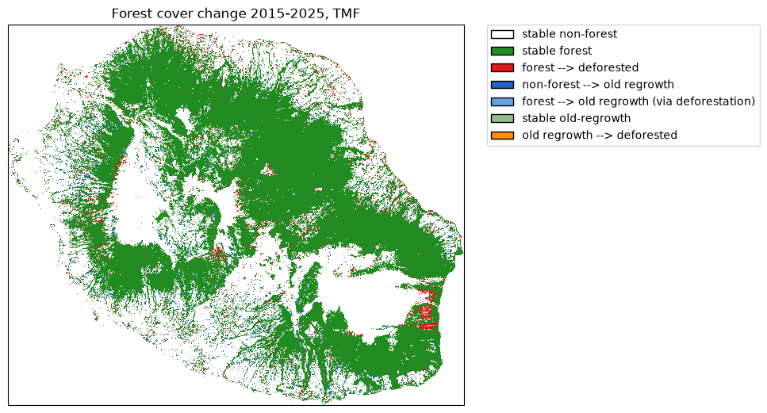

=============
Loss and gain
=============

Get forest cover change from TMF
--------------------------------

The function ``.get_fcc_loss_gain()`` can be used to download forest cover change
from the Tropical Moist Forest product.

This function, contrary to ``get_fcc_loss()`` which accounts only for loss in the forest cover change, considers both forest loss and gain (or regrowth) to derive the forest cover change map.

We will use the Reunion Island (isocode “REU”) as a case study.

.. code:: python

    import os

    import dask.array as da_
    import ee
    import geefcc
    import matplotlib.pyplot as plt
    from matplotlib.colors import ListedColormap
    import matplotlib.patches as mpatches
    import numpy as np
    import cartopy.crs as ccrs
    import rioxarray
    from osgeo import gdal
    import pandas as pd
    from tabulate import tabulate

    # Some convenient aliases
    opj = os.path.join

.. code:: python

    # Initialize GEE
    ee.Initialize(project="deforisk", opt_url="https://earthengine-highvolume.googleapis.com")

We want to estimate and map the forest cover change for the period 2015--2025, considering regrowth of at least 5 years as being forest, which is debatable (`Poorter & others 2016 <citeproc_bib_item_2>`_; `Bourgoin *et al.* 2024 <citeproc_bib_item_1>`_).

.. code:: python

    # Download data from GEE
    out_dir = "out_tmf_5yr"
    ofile = opj(out_dir, "fcc_tmf.tif") 
    if not os.path.isfile(ofile):
        geefcc.get_fcc_loss_gain(
            aoi="REU",
            year1=2015,
            year2=2025,
            min_years=5,
            source="tmf",
            tile_size=0.5,
            crop_to_aoi=True,
            parallel=True,
            output_file=ofile,
        )

::

    get_fcc running, 3 tiles .

.. code:: python

    # Load data
    fcc_tmf = rioxarray.open_rasterio(ofile)
    fcc_tmf

::

    <xarray.DataArray (band: 1, y: 1924, x: 2305)> Size: 4MB
    [4434820 values with dtype=uint8]
    Coordinates:
      * band         (band) int64 8B 1
      * y            (y) float64 15kB -20.87 -20.87 -20.87 ... -21.39 -21.39 -21.39
      * x            (x) float64 18kB 55.22 55.22 55.22 55.22 ... 55.84 55.84 55.84
        spatial_ref  int64 8B 0
    Attributes:
        AREA_OR_POINT:  Area
        _FillValue:     0
        scale_factor:   1.0
        add_offset:     0.0
        long_name:      fcc

Plot the forest cover change map
--------------------------------

.. code:: python

    # Colors
    cols=[(34, 139, 34, 255), (227, 26, 28, 255), (30, 100, 200, 255),
          (100, 160, 230, 255), (150, 190, 140, 255), (255, 140, 0, 255)]
    colors = [(1, 1, 1, 0)]  # transparent white for 0
    cmax = 255.0  # float for division
    for col in cols:
        col_class = tuple([i / cmax for i in col])
        colors.append(col_class)
    color_map = ListedColormap(colors)

    # Labels
    labels = {0: "stable non-forest", 1: "stable forest", 2: "forest --> deforested",
              3: "non-forest --> old regrowth", 4: "forest --> old regrowth (via deforestation)",
              5: "stable old-regrowth", 6: "old regrowth --> deforested"}
    patches = [mpatches.Patch(facecolor=col, edgecolor="black",
                              label=labels[i]) for (i, col) in enumerate(colors)]

.. code:: python

    # Plot
    fig = plt.figure()
    ax = fig.add_axes([0, 0, 1, 1], projection=ccrs.PlateCarree())
    raster_image = fcc_tmf.plot(ax=ax, cmap=color_map, add_colorbar=False)
    plt.title("Forest cover change 2015-2025, TMF")
    plt.legend(handles=patches, bbox_to_anchor=(1.05, 1), loc=2, borderaxespad=0.)
    fig.savefig("tmf.png", bbox_inches="tight", dpi=100)
    plt.close(fig)

Reproject for area computation
------------------------------

We need to reproject the raster before performing area computation. We use projection UTM zone 40S (EPSG code 34740) for Reunion island.

.. code:: python

    ifile = opj(out_dir, "fcc_tmf.tif")
    ofile = opj(out_dir, "fcc_tmf_utm.tif")
    ds = gdal.Warp(ofile, ifile, xRes=30, yRes=30, dstSRS="EPSG:32740", resampleAlg="near",
              targetAlignedPixels=True, creationOptions=["COMPRESS=DEFLATE"])
    ds = None

Deforestation and regrowth estimates
------------------------------------

We use functions ``bincount`` and dask arrays to compute the number of pixels per class and the corresponding area (in ha).

.. code:: python

    # Bincount with dask array
    ifile = opj(out_dir, "fcc_tmf_utm.tif")
    fcc_tmf_utm = rioxarray.open_rasterio(ifile, chunks={"x": 512, "y": 512})

    # Get pixel resolution in meters
    x_res, y_res = fcc_tmf_utm.rio.resolution()
    pixel_area_m2 = abs(x_res) * abs(y_res)

    # Count occurrences of each class (0-255) across all chunks in parallel
    fcc_flat = fcc_tmf_utm.data.ravel()
    counts = da_.bincount(fcc_flat, minlength=256).compute()

    # Keep only classes that actually appear in the raster
    present = np.nonzero(counts)[0]

    # Create data frame
    res_df = pd.DataFrame({
        "category": present,
        "label": list(labels.values()),
        "count": counts[present],
    })

    # Convert pixel count to area in hectares (1 ha = 10,000 m^2)
    res_df["area_ha"] = round(res_df["count"] * pixel_area_m2 / 10_000).astype(int)

    # Export
    res_df.to_csv(opj("fcc_statistics.csv"), index=False)
    tabulate(res_df, headers=res_df.columns, tablefmt="orgtbl", showindex=False)

.. table:: **Area per class of forest cover change.** A regrowth is considered “old” in this example if it has at least 5 years.

    +----------+---------------------------------------------+---------+----------+
    | category | label                                       |   count | area\_ha |
    +==========+=============================================+=========+==========+
    |        0 | stable non-forest                           | 2672678 |   240541 |
    +----------+---------------------------------------------+---------+----------+
    |        1 | stable forest                               | 1387668 |   124890 |
    +----------+---------------------------------------------+---------+----------+
    |        2 | forest --> deforested                       |   67986 |     6119 |
    +----------+---------------------------------------------+---------+----------+
    |        3 | non-forest --> old regrowth                 |   49882 |     4489 |
    +----------+---------------------------------------------+---------+----------+
    |        4 | forest --> old regrowth (via deforestation) |    1057 |       95 |
    +----------+---------------------------------------------+---------+----------+
    |        5 | stable old-regrowth                         |   14629 |     1317 |
    +----------+---------------------------------------------+---------+----------+
    |        6 | old regrowth --> deforested                 |     946 |       85 |
    +----------+---------------------------------------------+---------+----------+

We can then estimate gross loss, gross gain and net loss in forest cover change for the period 2015--2025. Category 4 (forest --> old regrowth via deforestation) is accounted for both gross loss and gain.

.. code:: python

    forest_t1 = res_df.loc[[1, 2, 4, 5, 6], "area_ha"].sum()
    forest_t2 = res_df.loc[[1, 3, 4, 5], "area_ha"].sum()
    gross_loss = - res_df.loc[[2, 4, 6], "area_ha"].sum()
    gross_gain = res_df.loc[[3, 4], "area_ha"].sum()
    lossgain_df = pd.DataFrame({
        "label": ["forest_t1", "forest_t2", "gross loss", "gross gain", "net loss"],
        "area_ha": [forest_t1, forest_t2, gross_loss, gross_gain, gross_gain + gross_loss],
    })
    time = 2025 - 2015
    lossgain_df["annual_change_ha"] = (lossgain_df["area_ha"] / time).round().astype(int)
    ratio = lossgain_df["area_ha"] / forest_t1
    lossgain_df["annual_change_perc"] = round(100 * (1 - pow((1 - ratio), 1 / time)), 2)
    lossgain_df.iloc[:2, 2:4] = np.nan

    # Export
    res_df.to_csv(opj("loss_gain_statistics.csv"), index=False)
    tabulate(lossgain_df, headers=lossgain_df.columns, tablefmt="orgtbl", showindex=False)

.. table::

    +------------+----------+--------------------+----------------------+
    | label      | area\_ha | annual\_change\_ha | annual\_change\_perc |
    +============+==========+====================+======================+
    | forest\_t1 |   132506 |                nan |                  nan |
    +------------+----------+--------------------+----------------------+
    | forest\_t2 |   130791 |                nan |                  nan |
    +------------+----------+--------------------+----------------------+
    | gross loss |    -6299 |               -630 |                -0.47 |
    +------------+----------+--------------------+----------------------+
    | gross gain |     4584 |                458 |                 0.35 |
    +------------+----------+--------------------+----------------------+
    | net loss   |    -1715 |               -172 |                -0.13 |
    +------------+----------+--------------------+----------------------+

When considering regrowth of at least 5 years, which is very short for forest recovery (`Bourgoin *et al.* 2024 <citeproc_bib_item_1>`_), the gain (458 ha/yr) compensates the forest cover loss (-630 ha/yr), and the net deforestation is small (-172 ha/yr). But if we consider regrowth of at least 10 years as being forest (``min_years=10`` in function ``get_fcc_loss_gain``), the gain is much smaller (202 ha/yr) and the net deforestation much higher (-427 ha/yr corresponding to -0.32 %/yr).

References
----------

 _`citeproc_bib_item_1` Bourgoin, C., Ceccherini, G., Girardello, M., Vancutsem, C., Avitabile, V., Beck, P.S.A., Beuchle, R., Blanc, L., Duveiller, G., Migliavacca, M., Vieilledent, G., Cescatti, A. & Achard, F. (2024) `Human degradation of tropical moist forests is greater than previously estimated <https://doi.org/10.1038/s41586-024-07629-0>`_. *Nature*, **631**, 570–576.

 _`citeproc_bib_item_2` Poorter, L. & others. (2016) `Biomass resilience of neotropical secondary forests <https://doi.org/10.1038/nature16512>`_. *Nature*, **530**, 211–214.
