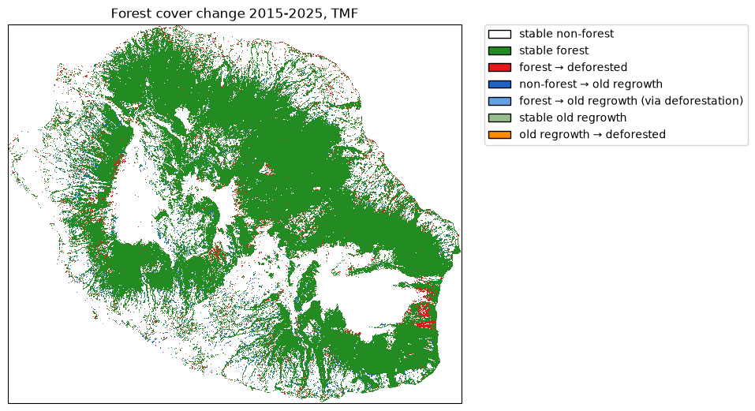

=============
Loss and gain
=============

Get forest cover change from TMF
--------------------------------

The function ``.get_fcc_loss_gain()`` can be used to download forest cover change
from the Tropical Moist Forest product.

This function, contrary to ``get_fcc_loss()`` which accounts only for loss in the forest cover change, considers both forest loss and gain (or regrowth) to derive the forest cover change map.

We will use the Reunion Island (isocode “REU”) as a case study.

.. code:: python

    import os

    import ee
    import geefcc
    import numpy as np
    import pandas as pd
    from tabulate import tabulate

    # Some convenient aliases
    opj = os.path.join

.. code:: python

    # Initialize GEE
    ee.Initialize(project="deforisk", opt_url="https://earthengine-highvolume.googleapis.com")

We want to estimate and map the forest cover change for the period 2015--2025, considering regrowth of at least 5 years as being forest, which is debatable :cite:p:`Poorter2016,Bourgoin2024`.

.. code:: python

    # Download data from GEE
    out_dir = "out_tmf_5yr"
    ofile = opj(out_dir, "fcc_tmf.tif") 
    if not os.path.isfile(ofile):
        geefcc.get_fcc_loss_gain(
            aoi="REU",
            year1=2015,
            year2=2025,
            min_years=5,
            tile_size=0.5,
            crop_to_aoi=True,
            parallel=True,
            output_file=ofile,
        )

Plot the forest cover change map
--------------------------------

.. code:: python

    geefcc.plot_fcc_tmf(
        input_file=ofile,
        output_file="fcc_loss_gain.png",
        title="Forest cover change 2015-2025, TMF",
        dpi=100,
    )

Area per class of forest cover change
-------------------------------------

We use function ``fcc_area()`` to reproject the raster and compute the number of pixels per class and the corresponding area (in ha). We use projection UTM zone 40S (EPSG code 32740) for Reunion island.

.. code:: python

    res_df = geefcc.fcc_area(
        input_file=ofile,
        epsg=32740,
        output_file="fcc_statistics.csv",
    )
    tabulate(res_df, headers=res_df.columns, tablefmt="orgtbl", showindex=False)

.. table:: **Area per class of forest cover change.** A regrowth is considered “old” in this example if it has at least 5 years.

    +----------+---------------------------------------------+---------+----------+
    | category | label                                       |   count | area\_ha |
    +==========+=============================================+=========+==========+
    |        0 | stable non-forest                           | 2672678 |   240541 |
    +----------+---------------------------------------------+---------+----------+
    |        1 | stable forest                               | 1387668 |   124890 |
    +----------+---------------------------------------------+---------+----------+
    |        2 | forest --> deforested                       |   67986 |     6119 |
    +----------+---------------------------------------------+---------+----------+
    |        3 | non-forest --> old regrowth                 |   49882 |     4489 |
    +----------+---------------------------------------------+---------+----------+
    |        4 | forest --> old regrowth (via deforestation) |    1057 |       95 |
    +----------+---------------------------------------------+---------+----------+
    |        5 | stable old-regrowth                         |   14629 |     1317 |
    +----------+---------------------------------------------+---------+----------+
    |        6 | old regrowth --> deforested                 |     946 |       85 |
    +----------+---------------------------------------------+---------+----------+

Deforestation and regrowth estimates
------------------------------------

We can then estimate gross loss, gross gain and net loss in forest cover change for the period 2015--2025. Category 4 (forest --> old regrowth via deforestation) is accounted for both gross loss and gain.

.. code:: python

    forest_t1 = res_df.loc[[1, 2, 4, 5, 6], "area_ha"].sum()
    forest_t2 = res_df.loc[[1, 3, 4, 5], "area_ha"].sum()
    gross_loss = - res_df.loc[[2, 4, 6], "area_ha"].sum()
    gross_gain = res_df.loc[[3, 4], "area_ha"].sum()
    lossgain_df = pd.DataFrame({
        "label": ["forest_t1", "forest_t2", "gross loss", "gross gain", "net change"],
        "area_ha": [forest_t1, forest_t2, gross_loss, gross_gain, gross_gain + gross_loss],
    })
    time = 2025 - 2015
    lossgain_df["annual_change_ha"] = (lossgain_df["area_ha"] / time).round().astype(int)
    ratio = lossgain_df["area_ha"] / forest_t1
    lossgain_df["annual_change_perc"] = round(100 * (1 - pow((1 - ratio), 1 / time)), 2)
    lossgain_df.iloc[:2, 2:4] = np.nan

    # Export
    lossgain_df.to_csv(opj("loss_gain_statistics.csv"), index=False)
    tabulate(lossgain_df, headers=lossgain_df.columns, tablefmt="orgtbl", showindex=False)

.. table::

    +------------+----------+--------------------+----------------------+
    | label      | area\_ha | annual\_change\_ha | annual\_change\_perc |
    +============+==========+====================+======================+
    | forest\_t1 |   132506 |                nan |                  nan |
    +------------+----------+--------------------+----------------------+
    | forest\_t2 |   130791 |                nan |                  nan |
    +------------+----------+--------------------+----------------------+
    | gross loss |    -6299 |               -630 |                -0.47 |
    +------------+----------+--------------------+----------------------+
    | gross gain |     4584 |                458 |                 0.35 |
    +------------+----------+--------------------+----------------------+
    | net change |    -1715 |               -172 |                -0.13 |
    +------------+----------+--------------------+----------------------+

When considering regrowth of at least 5 years, which is very short for forest recovery :cite:p:`Bourgoin2024`, the gain (458 ha/yr) compensates the forest cover loss (-630 ha/yr), and the net deforestation is small (-172 ha/yr).

If we consider regrowth of at least 10 years as being forest (``min_years=10`` in function ``get_fcc_loss_gain``), the gain is much smaller (202 ha/yr) and the net deforestation much higher (-427 ha/yr corresponding to -0.32 %/yr).

References
----------

.. bibliography:: ../refs.bib
   :filter: docname in docnames
