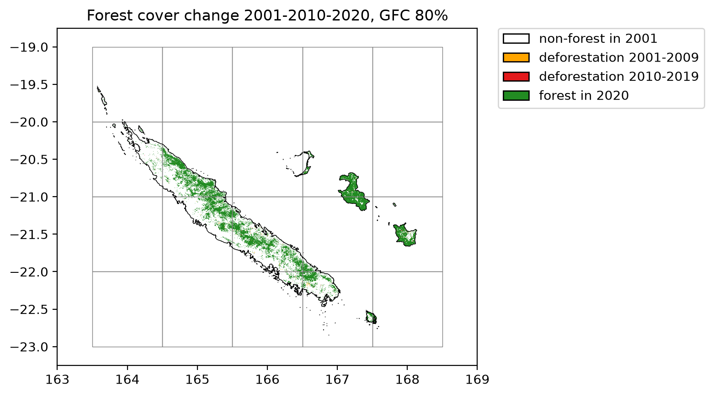
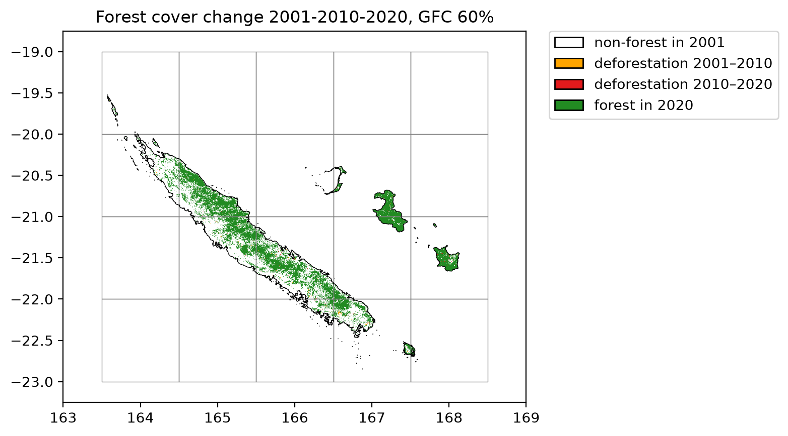

=============
New Caledonia
=============

Downloading data in parallel
----------------------------

We can use ``geefcc`` to download forest cover change for large countries, for example New-Caledonia. The country will be divided into several tiles which are processed in parallel. If your computer has n cores, n-1 cores will be used in parallel.

.. code:: python

    import os
    from pathlib import Path
    import time

    import ee
    import geefcc
    import pandas as pd
    from tabulate import tabulate

We initialize Google Earth Engine.

.. code:: python

    # Initialize GEE
    ee.Initialize(project="deforisk",
                  opt_url=("https://earthengine-highvolume."
                           "googleapis.com"))

We can compute the number of cores used for the computation.

.. code:: python

    ncpu = os.cpu_count() - 1
    ncpu

::

    7

Using TMF product
-----------------

Downloading data
~~~~~~~~~~~~~~~~

We download the forest cover change data from GEE for New Caledonia for years 2001, 2010 and 2020, using a tile size of one degree. We use the TMF product.

.. code:: python

    years_tmf = [2001, 2010, 2020]
    out_dir_tmf = Path("out_tmf")
    ofile_tmf = out_dir_tmf / "forest_tmf.tif"

    start_time = time.time()
    if not ofile_tmf.is_file():
        geefcc.get_fcc_loss(
            aoi=(163.5, -23, 168.15, -19.51),
            buff=0.0,
            years=years_tmf,
            source="tmf",
            tile_size=1.0,
            crop_to_aoi=True,
            output_file=ofile_tmf,
            parallel=True,
            ncpu=ncpu,
        )
    end_time = time.time()

::

    get_fcc running, 20 tiles .....................

We estimate the computation time to download 20 1-degree tiles using several cores.

.. code:: python

    elapsed_time = (end_time - start_time) / 60
    print('Execution time:', round(elapsed_time, 2), 'minutes')

::

    Execution time: 1.2 minutes

Transform multiband fcc raster in one band raster
~~~~~~~~~~~~~~~~~~~~~~~~~~~~~~~~~~~~~~~~~~~~~~~~~

We transform the data to have only one band describing the forest cover change with 0 for non-forest, 1 for deforestation on the period 2001--2009, 2 for deforestation on the period 2010--2019, and 3 for the remaining forest in 2020. To do so, we just sum the values of the raster bands.

.. code:: python

    fcc_file_tmf = out_dir_tmf / "fcc_tmf.tif"
    if not fcc_file_tmf.is_file():
        geefcc.sum_raster_bands(
            input_file=ofile_tmf,
            output_file=fcc_file_tmf,
            verbose=False,
        )

Plot the forest cover change map
~~~~~~~~~~~~~~~~~~~~~~~~~~~~~~~~

We plot the forest cover change map. The raster is automatically resampled to a coarser resolution before plotting as it exceeds the default pixel threshold. Country borders and the tile grid are overlaid directly from their vector files.

.. code:: python

    geefcc.plot_fcc_loss(
        input_file=fcc_file_tmf,
        years=years_tmf,
        output_file="fcc_tmf.png",
        title="Forest cover change 2001-2010-2020, TMF",
        dpi=200,
        borders=Path("data") / "borders_NCL.gpkg",
        grid=out_dir_tmf / "grid.gpkg",
        xlim=(163, 169),
        ylim=(-23.25, -18.75),
    )

Lines in black represent country borders. One degree tiles in grey cover the whole buffer and were used to download the data in parallel.

Reproject in EPSG:3163 for area computation
~~~~~~~~~~~~~~~~~~~~~~~~~~~~~~~~~~~~~~~~~~~

.. code:: python

    res_df_tmf = geefcc.stat_fcc_loss(
        input_file=fcc_file_tmf,
        years=years_tmf,
        epsg=3163,
        output_file="fcc_statistics_tmf.csv",
    )
    tabulate(res_df_tmf, headers=res_df_tmf.columns, tablefmt="orgtbl", showindex=False)

.. table::

    +----------+-------------------------+-----------+----------+
    | category | label                   |     count | area\_ha |
    +==========+=========================+===========+==========+
    |        0 | non-forest in 2001      | 200532616 |   893779 |
    +----------+-------------------------+-----------+----------+
    |        1 | deforestation 2001-2010 |    291545 |     2915 |
    +----------+-------------------------+-----------+----------+
    |        2 | deforestation 2010-2020 |    258015 |     2322 |
    +----------+-------------------------+-----------+----------+
    |        3 | forest in 2020          |   9381325 |   844319 |
    +----------+-------------------------+-----------+----------+

Using GFC product and tree cover >= 80%
---------------------------------------

Downloading data
~~~~~~~~~~~~~~~~

We download the forest cover change data from GEE for New Caledonia for years 2001, 2010 and 2020, using a tile size of one degree. We use the GFC product and a tree cover percentage >= 80 to define the forest.

.. code:: python

    years_gfc = [2001, 2010, 2020]
    out_dir_gfc80 = Path("out_gfc80")
    ofile_gfc80 = out_dir_gfc80 / "forest_gfc80.tif"

    start_time = time.time()
    if not ofile_gfc80.is_file():
        geefcc.get_fcc_loss(
            aoi=(163.5, -23, 168.15, -19.51),
            buff=0.0,
            years=years_gfc,
            source="gfc",
            perc=80,
            tile_size=1.0,
            crop_to_aoi=True,
            output_file=ofile_gfc80,
            parallel=True,
            ncpu=ncpu,
        )
    end_time = time.time()

We estimate the computation time to download 20 1-degree tiles using several cores.

.. code:: python

    elapsed_time = (end_time - start_time) / 60
    print('Execution time:', round(elapsed_time, 2), 'minutes')

::

    Execution time: 1.0 minutes

Transform multiband fcc raster in one band raster
~~~~~~~~~~~~~~~~~~~~~~~~~~~~~~~~~~~~~~~~~~~~~~~~~

.. code:: python

    fcc_file_gfc80 = out_dir_gfc80 / "fcc_gfc80.tif"
    if not fcc_file_gfc80.is_file():
        geefcc.sum_raster_bands(
            input_file=ofile_gfc80,
            output_file=fcc_file_gfc80,
            verbose=False,
        )

Plot the forest cover change map
~~~~~~~~~~~~~~~~~~~~~~~~~~~~~~~~

.. code:: python

    geefcc.plot_fcc_loss(
        input_file=fcc_file_gfc80,
        years=years_gfc,
        output_file="fcc_gfc80.png",
        title="Forest cover change 2001-2010-2020, GFC 80%",
        dpi=200,
        borders=Path("data") / "borders_NCL.gpkg",
        grid=out_dir_gfc80 / "grid.gpkg",
        xlim=(163, 169),
        ylim=(-23.25, -18.75),
    )

Lines in black represent country borders. One degree tiles in grey cover the whole buffer and were used to download the data in parallel.

Compute statistics
~~~~~~~~~~~~~~~~~~

.. code:: python

    res_df_gfc80 = geefcc.stat_fcc_loss(
        input_file=fcc_file_gfc80,
        years=years_gfc,
        epsg=3163,
        output_file="fcc_statistics_gfc80.csv",
    )
    tabulate(res_df_gfc80, headers=res_df_gfc80.columns, tablefmt="orgtbl", showindex=False)

.. table::

    +----------+-------------------------+-----------+----------+
    | category | label                   |     count | area\_ha |
    +==========+=========================+===========+==========+
    |        0 | non-forest in 2001      | 200532616 |   661023 |
    +----------+-------------------------+-----------+----------+
    |        1 | deforestation 2001-2010 |     41624 |      416 |
    +----------+-------------------------+-----------+----------+
    |        2 | deforestation 2010-2020 |     27874 |      251 |
    +----------+-------------------------+-----------+----------+
    |        3 | forest in 2020          |   7275205 |   654768 |
    +----------+-------------------------+-----------+----------+

Using GFC product and tree cover >= 60%
---------------------------------------

Downloading data
~~~~~~~~~~~~~~~~

We download the forest cover change data from GEE for New Caledonia for years 2001, 2010 and 2020, using a tile size of one degree. We use the GFC product and a tree cover percentage >= 60 to define the forest.

.. code:: python

    out_dir_gfc60 = Path("out_gfc60")
    ofile_gfc60 = out_dir_gfc60 / "forest_gfc60.tif"

    start_time = time.time()
    if not ofile_gfc60.is_file():
        geefcc.get_fcc_loss(
            aoi=(163.5, -23, 168.15, -19.51),
            buff=0.0,
            years=years_gfc,
            source="gfc",
            perc=60,
            tile_size=1.0,
            crop_to_aoi=True,
            output_file=ofile_gfc60,
            parallel=True,
            ncpu=ncpu,
        )
    end_time = time.time()

We estimate the computation time to download 20 1-degree tiles using several cores.

.. code:: python

    elapsed_time = (end_time - start_time) / 60
    print('Execution time:', round(elapsed_time, 2), 'minutes')

::

    Execution time: 1.12 minutes

Transform multiband fcc raster in one band raster
~~~~~~~~~~~~~~~~~~~~~~~~~~~~~~~~~~~~~~~~~~~~~~~~~

.. code:: python

    fcc_file_gfc60 = out_dir_gfc60 / "fcc_gfc60.tif"
    if not fcc_file_gfc60.is_file():
        geefcc.sum_raster_bands(
            input_file=ofile_gfc60,
            output_file=fcc_file_gfc60,
            verbose=False,
        )

Plot the forest cover change map
~~~~~~~~~~~~~~~~~~~~~~~~~~~~~~~~

.. code:: python

    geefcc.plot_fcc_loss(
        input_file=fcc_file_gfc60,
        years=years_gfc,
        output_file="fcc_gfc60.png",
        title="Forest cover change 2001-2010-2020, GFC 60%",
        dpi=200,
        borders=Path("data") / "borders_NCL.gpkg",
        grid=out_dir_gfc60 / "grid.gpkg",
        xlim=(163, 169),
        ylim=(-23.25, -18.75),
    )

Lines in black represent country borders. One degree tiles in grey cover the whole buffer and were used to download the data in parallel.

Compute statistics
~~~~~~~~~~~~~~~~~~

.. code:: python

    res_df_gfc60 = geefcc.stat_fcc_loss(
        input_file=fcc_file_gfc60,
        years=years_gfc,
        epsg=3163,
        output_file="fcc_statistics_gfc60.csv",
    )
    tabulate(res_df_gfc60, headers=res_df_gfc60.columns, tablefmt="orgtbl", showindex=False)

.. table::

    +----------+-------------------------+-----------+----------+
    | category | label                   |     count | area\_ha |
    +==========+=========================+===========+==========+
    |        0 | non-forest in 2001      | 200532616 |   899493 |
    +----------+-------------------------+-----------+----------+
    |        1 | deforestation 2001-2010 |     73854 |      739 |
    +----------+-------------------------+-----------+----------+
    |        2 | deforestation 2010-2020 |     60386 |      544 |
    +----------+-------------------------+-----------+----------+
    |        3 | forest in 2020          |   9860124 |   887411 |
    +----------+-------------------------+-----------+----------+

Summary of the results
----------------------

.. code:: python

    def areas_from_df(df, product, version, perc=""):
        fc1 = df.loc[df["category"].isin([1, 2, 3]), "area_ha"].sum()
        fc2 = df.loc[df["category"].isin([2, 3]), "area_ha"].sum()
        fc3 = df.loc[df["category"] == 3, "area_ha"].sum()
        d1 = df.loc[df["category"] == 1, "area_ha"].values[0]
        d2 = df.loc[df["category"] == 2, "area_ha"].values[0]
        n_years1 = years_gfc[1] - years_gfc[0]
        n_years2 = years_gfc[2] - years_gfc[1]
        return {"product": product, "version": version, "perc": perc,
                "fc2001": fc1, "fc2010": fc2, "fc2020": fc3,
                "d1": round(d1 / n_years1), "d2": round(d2 / n_years2)}

    tmf_areas = areas_from_df(res_df_tmf, "tmf", "v1_2025", "")
    gfc80_areas = areas_from_df(res_df_gfc80, "gfc", "v1_13(2025)", 80)
    gfc60_areas = areas_from_df(res_df_gfc60, "gfc", "v1_13(2025)", 60)

    res_df = pd.DataFrame([tmf_areas, gfc80_areas, gfc60_areas])
    res_df.to_csv("comparison_geefcc_nc.csv", index=False)
    tabulate(res_df, headers=res_df.columns, tablefmt="orgtbl")

.. table:: **Comparing forest-cover change products for New Caledonia.** **fc**: forest cover (in ha), **d1**: mean annual deforestation (in ha) in the first period 2001--2010, **d2**: mean annual deforestation (in ha) in the second period 2010--2020, **perc**: tree cover threshold (in %) used to define the forest with GFC.

    +---+---------+--------------+------+--------+--------+--------+------+------+
    | \ | product | version      | perc | fc2001 | fc2010 | fc2020 |   d1 |   d2 |
    +===+=========+==============+======+========+========+========+======+======+
    | 0 | tmf     | v1\_2025     | \    | 893779 | 867540 | 844319 | 2915 | 2322 |
    +---+---------+--------------+------+--------+--------+--------+------+------+
    | 1 | gfc     | v1\_13(2025) |   80 | 661023 | 657277 | 654768 |  416 |  251 |
    +---+---------+--------------+------+--------+--------+--------+------+------+
    | 2 | gfc     | v1\_13(2025) |   60 | 899493 | 892846 | 887411 |  739 |  544 |
    +---+---------+--------------+------+--------+--------+--------+------+------+

Forest cover for TMF and GFC with tree cover >= 60% are similar in 2020 (about 850,000 ha) but the annual deforestation is 4-5 times lower when using the GFC product (e.g. 544 ha/yr for GFC in the period 2010--2020 against 2322 ha/yr for TMF for the same period).
