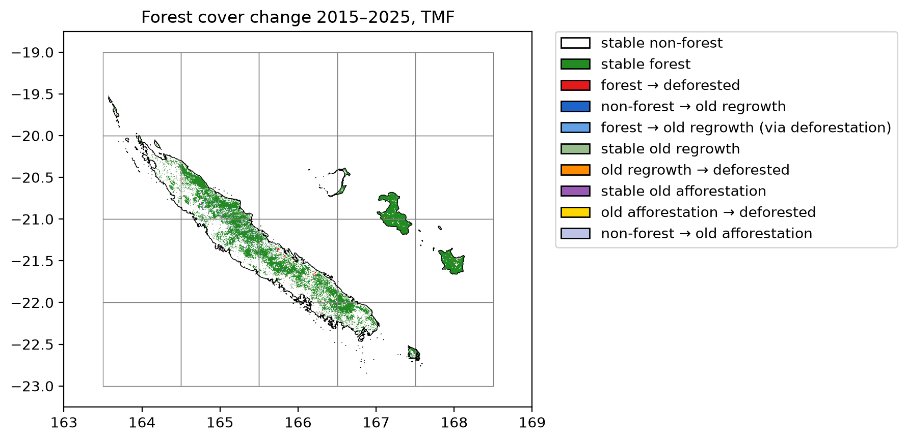

#+title: New Caledonia with loss and gain
#+options: toc:nil title:t num:nil author:nil ^:{}
#+property: header-args:python :results output :session :exports both
#+property: header-args :eval never-export
#+export_select_tags: export
#+export_exclude_tags: noexport

#+bibliography: ../refs.bib
#+cite_export: oc-rst

* Get forest cover change from TMF

The function =.get_fcc_loss_gain()= can be used to download forest cover change from the Tropical Moist Forest product.

This function considers both forest loss and gain (or regrowth) to derive the forest cover change map.

We will use New Caledonia as a case study.

#+begin_src python :results none
from pathlib import Path
import time

import ee
import geefcc
import numpy as np
import pandas as pd
from tabulate import tabulate
#+end_src

#+RESULTS:

#+begin_src python :results none
# Initialize GEE
ee.Initialize(project="deforisk", opt_url="https://earthengine-highvolume.googleapis.com")
#+end_src

We want to estimate and map the forest cover change for the period 2015--2025, considering regrowth of at least 10 years as being forest, which is debatable [cite:@Poorter2016; @Bourgoin2024].

#+begin_src python
# Download data from GEE
min_years = 10
out_dir = Path(f"out_tmf_{min_years}yr")
ofile = out_dir / "fcc_tmf.tif"
if not ofile.is_file():
    start_time = time.time()
    geefcc.get_fcc_loss_gain(
        aoi=(163.5, -23, 168.15, -19.51),
        year1=2015,
        year2=2025,
        min_years=min_years,
        tile_size=1,
        crop_to_aoi=True,
        parallel=True,
        output_file=ofile,
    )
    end_time = time.time()
#+end_src

#+RESULTS:

We estimate the computation time to download 20 1-degree tiles using several cores.

#+begin_src python
elapsed_time = (end_time - start_time) / 60
print('Execution time:', round(elapsed_time, 2), 'minutes')
#+end_src

#+RESULTS:
: Execution time: 1.25 minutes

* Plot the forest cover change map

We plot the forest cover change map. The raster is automatically resampled to a coarser resolution before plotting as it exceeds the default pixel threshold. Country borders and the tile grid are overlaid directly from their vector files.

#+begin_src python :results none
geefcc.plot_fcc_loss_gain(
    input_file=ofile,
    output_file=f"fcc_tmf_{min_years}yr.png",
    title="Forest cover change 2015\u20132025, TMF",
    dpi=200,
    borders=Path("data") / "borders_NCL.gpkg",
    grid=out_dir / "grid.gpkg",
    xlim=(163, 169),
    ylim=(-23.25, -18.75),
)
#+end_src

#+attr_rst: :width 100% :align center

Lines in black represent country borders. One degree tiles in grey cover the whole buffer and were used to download the data in parallel.

* Area per class of forest cover change

We use function =stat_fcc_loss_gain()= to reproject the raster and compute the number of pixels per class and the corresponding area (in ha). We use projection UTM zone 58S (EPSG code 32758) for New Caledonia.

#+begin_src python :results value raw :exports both
res_df = geefcc.stat_fcc_loss_gain(
    input_file=ofile,
    epsg=32758,
    output_file=f"fcc_statistics_{min_years}yr.csv",
)
tabulate(res_df, headers=res_df.columns, tablefmt="orgtbl", showindex=False)
#+end_src

#+RESULTS:
| category | label                                       |     count |  area_ha |
|----------+---------------------------------------------+-----------+----------|
|        0 | stable non-forest                           | 201155951 | 18104036 |
|        1 | stable forest                               |   9349449 |   841450 |
|        2 | forest --> deforested                       |    177846 |    16006 |
|        3 | non-forest --> old regrowth                 |     69727 |     6275 |
|        4 | forest --> old regrowth (via deforestation) |         0 |        0 |
|        5 | stable old-regrowth                         |     12317 |     1109 |
|        6 | old regrowth --> deforested                 |      1522 |      137 |
|        7 | stable old afforestation                    |    187208 |    16849 |
|        8 | old afforestation --> deforested            |        51 |        5 |
|        9 | non-forest --> old afforestation            |    412777 |    37150 |

* Deforestation and regrowth estimates

We can then estimate gross loss, gross gain and net loss in forest cover change for the period 2015--2025. Category 4 (forest --> old regrowth via deforestation) is accounted for both gross loss and gain.

#+begin_src python :results value raw :exports both
forest_t1 = res_df.loc[[1, 2, 4, 5, 6, 7, 8], "area_ha"].sum()
forest_t2 = res_df.loc[[1, 3, 4, 5, 7, 9], "area_ha"].sum()
gross_loss = - res_df.loc[[2, 4, 6, 8], "area_ha"].sum()
gross_gain = res_df.loc[[3, 4, 9], "area_ha"].sum()
lossgain_df = pd.DataFrame({
    "label": ["forest_t1", "forest_t2", "gross loss", "gross gain", "net change"],
    "area_ha": [forest_t1, forest_t2, gross_loss, gross_gain, gross_gain + gross_loss],
})
time = 2025 - 2015
lossgain_df["annual_change_ha"] = (lossgain_df["area_ha"] / time).round().astype(int)
ratio = lossgain_df["area_ha"] / forest_t1
lossgain_df["annual_change_perc"] = round(100 * (1 - pow((1 - ratio), 1 / time)), 2)
lossgain_df.iloc[:2, 2:4] = np.nan

# Export
lossgain_df.to_csv(f"loss_gain_statistics_{min_years}yr.csv", index=False)
tabulate(lossgain_df, headers=lossgain_df.columns, tablefmt="orgtbl", showindex=False)
#+end_src

#+RESULTS:
| label      | area_ha | annual_change_ha | annual_change_perc |
|------------+---------+------------------+--------------------|
| forest_t1  |  875556 |              nan |                nan |
| forest_t2  |  902833 |              nan |                nan |
| gross loss |  -16148 |            -1615 |              -0.18 |
| gross gain |   43425 |             4342 |               0.51 |
| net change |   27277 |             2728 |               0.32 |

When considering regrowth of at least 10 years, which is short for forest recovery [cite:@Bourgoin2024], the gain (4342 ha/yr) compensates the forest cover loss (-1615 ha/yr), and the net change is positive (2728 ha/yr, corresponding to 0.32 %/yr).

When disregarding afforestation (categories 8 and 9, which might be several things including missed forest in the past), figures are different:

#+begin_src python :results value raw :exports both
forest_t1 = res_df.loc[[1, 2, 4, 5, 6, 7], "area_ha"].sum()
forest_t2 = res_df.loc[[1, 3, 4, 5, 7], "area_ha"].sum()
gross_loss = - res_df.loc[[2, 4, 6], "area_ha"].sum()
gross_gain = res_df.loc[[3, 4], "area_ha"].sum()
lossgain_df = pd.DataFrame({
    "label": ["forest_t1", "forest_t2", "gross loss", "gross gain", "net change"],
    "area_ha": [forest_t1, forest_t2, gross_loss, gross_gain, gross_gain + gross_loss],
})
time = 2025 - 2015
lossgain_df["annual_change_ha"] = (lossgain_df["area_ha"] / time).round().astype(int)
ratio = lossgain_df["area_ha"] / forest_t1
lossgain_df["annual_change_perc"] = round(100 * (1 - pow((1 - ratio), 1 / time)), 2)
lossgain_df.iloc[:2, 2:4] = np.nan

# Export
lossgain_df.to_csv(f"loss_gain_statistics_{min_years}yr_noaff.csv", index=False)
tabulate(lossgain_df, headers=lossgain_df.columns, tablefmt="orgtbl", showindex=False)
#+end_src

#+RESULTS:
| label      | area_ha | annual_change_ha | annual_change_perc |
|------------+---------+------------------+--------------------|
| forest_t1  |  875551 |              nan |                nan |
| forest_t2  |  865683 |              nan |                nan |
| gross loss |  -16143 |            -1614 |              -0.18 |
| gross gain |    6275 |              628 |               0.07 |
| net change |   -9868 |             -987 |              -0.11 |

In this case, the gain (628 ha/yr) does not compensate for the loss (-1614 ha/yr), and the net change is negative (-987 ha/yr, corresponding to -0.11 %/yr).

* References

#+print_bibliography:

# End Of File
