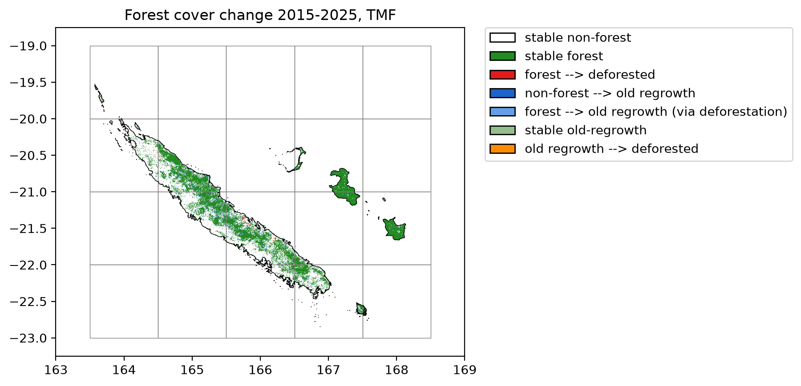

================================
New Caledonia with loss and gain
================================

Get forest cover change from TMF
--------------------------------

The function ``.get_fcc_loss_gain()`` can be used to download forest cover change from the Tropical Moist Forest product.

This function considers both forest loss and gain (or regrowth) to derive the forest cover change map.

We will use New Caledonia as a case study.

.. code:: python

    from pathlib import Path
    import time

    import ee
    import geefcc
    import numpy as np
    import pandas as pd
    from tabulate import tabulate

.. code:: python

    # Initialize GEE
    ee.Initialize(project="deforisk", opt_url="https://earthengine-highvolume.googleapis.com")

We want to estimate and map the forest cover change for the period 2015--2025, considering regrowth of at least 5 years as being forest, which is debatable :cite:p:`Poorter2016,Bourgoin2024`.

.. code:: python

    # Download data from GEE
    min_years = 5
    out_dir = Path(f"out_tmf_{min_years}yr")
    ofile = out_dir / "fcc_tmf.tif"
    if not ofile.is_file():
        start_time = time.time()
        geefcc.get_fcc_loss_gain(
            aoi=(163.5, -23, 168.15, -19.51),
            year1=2015,
            year2=2025,
            min_years=min_years,
            tile_size=1,
            crop_to_aoi=True,
            parallel=True,
            output_file=ofile,
        )
        end_time = time.time()

We estimate the computation time to download 20 1-degree tiles using several cores.

.. code:: python

    elapsed_time = (end_time - start_time) / 60
    print('Execution time:', round(elapsed_time, 2), 'minutes')

::

    Execution time: 1.19 minutes

Plot the forest cover change map
--------------------------------

We plot the forest cover change map. The raster is automatically resampled to a coarser resolution before plotting as it exceeds the default pixel threshold. Country borders and the tile grid are overlaid directly from their vector files.

.. code:: python

    geefcc.plot_fcc_loss_gain(
        input_file=ofile,
        output_file=f"fcc_tmf_{min_years}yr.png",
        title="Forest cover change 2015-2025, TMF",
        dpi=200,
        borders=Path("data") / "borders_NCL.gpkg",
        grid=out_dir / "grid.gpkg",
        xlim=(163, 169),
        ylim=(-23.25, -18.75),
    )

Lines in black represent country borders. One degree tiles in grey cover the whole buffer and were used to download the data in parallel.

Area per class of forest cover change
-------------------------------------

We use function ``stat_fcc_loss_gain()`` to reproject the raster and compute the number of pixels per class and the corresponding area (in ha). We use projection UTM zone 58S (EPSG code 32758) for New Caledonia.

.. code:: python

    res_df = geefcc.stat_fcc_loss_gain(
        input_file=ofile,
        epsg=32758,
        output_file=f"fcc_statistics_{min_years}yr.csv",
    )
    tabulate(res_df, headers=res_df.columns, tablefmt="orgtbl", showindex=False)

.. table::

    +----------+---------------------------------------------+-----------+----------+
    | category | label                                       |     count | area\_ha |
    +==========+=============================================+===========+==========+
    |        0 | stable non-forest                           | 200532616 | 18047935 |
    +----------+---------------------------------------------+-----------+----------+
    |        1 | stable forest                               |   9349449 |   841450 |
    +----------+---------------------------------------------+-----------+----------+
    |        2 | forest --> deforested                       |    161223 |    14510 |
    +----------+---------------------------------------------+-----------+----------+
    |        3 | non-forest --> old regrowth                 |    781232 |    70311 |
    +----------+---------------------------------------------+-----------+----------+
    |        4 | forest --> old regrowth (via deforestation) |     16623 |     1496 |
    +----------+---------------------------------------------+-----------+----------+
    |        5 | stable old-regrowth                         |    516513 |    46486 |
    +----------+---------------------------------------------+-----------+----------+
    |        6 | old regrowth --> deforested                 |      9192 |      827 |
    +----------+---------------------------------------------+-----------+----------+

Deforestation and regrowth estimates
------------------------------------

We can then estimate gross loss, gross gain and net loss in forest cover change for the period 2015--2025. Category 4 (forest --> old regrowth via deforestation) is accounted for both gross loss and gain.

.. code:: python

    forest_t1 = res_df.loc[[1, 2, 4, 5, 6], "area_ha"].sum()
    forest_t2 = res_df.loc[[1, 3, 4, 5], "area_ha"].sum()
    gross_loss = - res_df.loc[[2, 4, 6], "area_ha"].sum()
    gross_gain = res_df.loc[[3, 4], "area_ha"].sum()
    lossgain_df = pd.DataFrame({
        "label": ["forest_t1", "forest_t2", "gross loss", "gross gain", "net change"],
        "area_ha": [forest_t1, forest_t2, gross_loss, gross_gain, gross_gain + gross_loss],
    })
    time = 2025 - 2015
    lossgain_df["annual_change_ha"] = (lossgain_df["area_ha"] / time).round().astype(int)
    ratio = lossgain_df["area_ha"] / forest_t1
    lossgain_df["annual_change_perc"] = round(100 * (1 - pow((1 - ratio), 1 / time)), 2)
    lossgain_df.iloc[:2, 2:4] = np.nan

    # Export
    lossgain_df.to_csv(f"loss_gain_statistics_{min_years}yr.csv", index=False)
    tabulate(lossgain_df, headers=lossgain_df.columns, tablefmt="orgtbl", showindex=False)

.. table::

    +------------+----------+--------------------+----------------------+
    | label      | area\_ha | annual\_change\_ha | annual\_change\_perc |
    +============+==========+====================+======================+
    | forest\_t1 |   904769 |                nan |                  nan |
    +------------+----------+--------------------+----------------------+
    | forest\_t2 |   959743 |                nan |                  nan |
    +------------+----------+--------------------+----------------------+
    | gross loss |   -16833 |              -1683 |                -0.18 |
    +------------+----------+--------------------+----------------------+
    | gross gain |    71807 |               7181 |                 0.82 |
    +------------+----------+--------------------+----------------------+
    | net change |    54974 |               5497 |                 0.62 |
    +------------+----------+--------------------+----------------------+

When considering regrowth of at least 5 years, which is very short for forest recovery :cite:p:`Bourgoin2024`, the gain (7181 ha/yr) compensates the forest cover loss (-1683 ha/yr), and the net change is positive (5947 ha/yr).

If we consider regrowth of at least 10 years as being forest (``min_years=10`` in function ``get_fcc_loss_gain``), the gain is much smaller (4342 ha/yr), but the net change is still positive (2728 ha/yr corresponding to 0.32 %/yr).

References
----------

.. bibliography:: ../refs.bib
   :filter: docname in docnames
