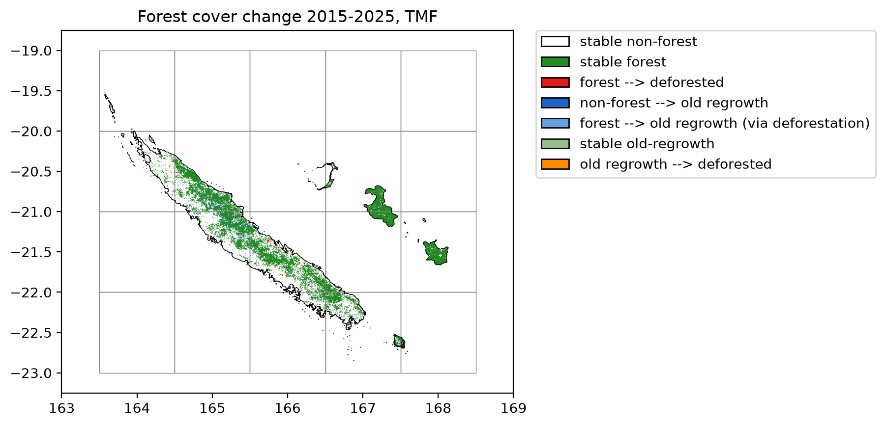

#+title: Forest cover change in New Caledonia with loss and gain
#+options: toc:nil title:t num:nil author:nil ^:{}
#+property: header-args:python :results output :session :exports both
#+property: header-args :eval never-export
#+export_select_tags: export
#+export_exclude_tags: noexport

#+bibliography: ../refs.bib
#+cite_export: oc-rst

* Get forest cover change from TMF

The function =.get_fcc_loss_gain()= can be used to download forest cover change from the Tropical Moist Forest product.

This function considers both forest loss and gain (or regrowth) to derive the forest cover change map.

We will use New Caledonia as a case study.

#+begin_src python :results none
import os
import time

import dask.array as da_
import ee
import geefcc
import matplotlib.pyplot as plt
from matplotlib.colors import ListedColormap
import matplotlib.patches as mpatches
import numpy as np
import cartopy.crs as ccrs
import rioxarray
from osgeo import gdal
import pandas as pd
from tabulate import tabulate
import geopandas

# Some convenient aliases
opj = os.path.join
#+end_src

#+RESULTS:

#+begin_src python :results none
# Initialize GEE
ee.Initialize(project="deforisk", opt_url="https://earthengine-highvolume.googleapis.com")
#+end_src

We want to estimate and map the forest cover change for the period 2015--2025, considering regrowth of at least 5 years as being forest, which is debatable [cite:@Poorter2016; @Bourgoin2024].

#+begin_src python
# Download data from GEE
min_years = 10
out_dir = f"out_tmf_{min_years}yr"
ofile = opj(out_dir, "fcc_tmf.tif")
if not os.path.isfile(ofile):
    start_time = time.time()
    geefcc.get_fcc_loss_gain(
        aoi=(163.5, -23, 168.15, -19.51),
        year1=2015,
        year2=2025,
        min_years=min_years,
        tile_size=1,
        crop_to_aoi=True,
        parallel=True,
        output_file=ofile,
    )
    end_time = time.time()
#+end_src

#+RESULTS:

We estimate the computation time to download 20 1-degree tiles using several cores. 

#+begin_src python
elapsed_time = (end_time - start_time) / 60
print('Execution time:', round(elapsed_time, 2), 'minutes')
#+end_src

#+RESULTS:
: Execution time: 1.11 minutes

* Plot the forest cover change map

** Resampling at lower resolution

We resample at a lower resolution for plotting.

#+begin_src python :results none
infn = opj(out_dir, "fcc_tmf.tif")
outfn = opj(out_dir, "fcc_tmf_coarsen.tif")
scale = gdal.Open(infn).GetGeoTransform()[1]
xres = 20 * scale
yres = 20 * scale
resample_alg = "near"

ds = gdal.Warp(outfn, infn, xRes=xres, yRes=yres, resampleAlg=resample_alg)
ds = None
#+end_src

** Creating the color map

#+begin_src python :results none
# Colors
cols=[(34, 139, 34, 255), (227, 26, 28, 255), (30, 100, 200, 255),
      (100, 160, 230, 255), (150, 190, 140, 255), (255, 140, 0, 255)]
colors = [(1, 1, 1, 0)]  # transparent white for 0
cmax = 255.0  # float for division
for col in cols:
    col_class = tuple([i / cmax for i in col])
    colors.append(col_class)
color_map = ListedColormap(colors)

# Labels
labels = {0: "stable non-forest", 1: "stable forest", 2: "forest --> deforested",
          3: "non-forest --> old regrowth", 4: "forest --> old regrowth (via deforestation)",
          5: "stable old-regrowth", 6: "old regrowth --> deforested"}
patches = [mpatches.Patch(facecolor=col, edgecolor="black",
                          label=labels[i]) for (i, col) in enumerate(colors)]
#+end_src

** Plotting

We create a short function to plot the forest cover change map.

#+begin_src python :results none
def plot_fcc(title, out_file):
    fig = plt.figure()
    ax = plt.subplot(111)
    ax.imshow(raster_image, cmap=color_map, extent=extent,
              resample=False)
    ax.set_aspect("equal") 
    grid_image = grid.boundary.plot(ax=ax, color="grey", linewidth=0.5)
    borders_image = borders.boundary.plot(ax=ax, color="black", linewidth=0.5)
    plt.title(title)
    plt.legend(handles=patches, bbox_to_anchor=(1.05, 1), loc=2, borderaxespad=0.)
    plt.xlim((163, 169))
    plt.ylim((-23.25, -18.75))
    fig.savefig(out_file, bbox_inches="tight", dpi=200)
    plt.close(fig)
#+end_src

We load the data: country borders and grid. The borders can be downloaded from the [[https://gadm.org/download_country.html][gadm]] website. 

#+begin_src python :results none
# Borders
borders_gpkg = opj("data", "borders_NCL.gpkg")
borders = geopandas.read_file(borders_gpkg)

# Grid
grid_gpkg = opj(out_dir, "grid.gpkg")
grid = geopandas.read_file(grid_gpkg)
#+end_src

We plot the forest cover change map.

#+begin_src python :results none
with gdal.Open(opj(out_dir, "fcc_tmf_coarsen.tif"), gdal.GA_ReadOnly) as ds:
    raster_image = ds.ReadAsArray()
    nrow, ncol = raster_image.shape
    xmin, xres, _, ymax, _, yres = ds.GetGeoTransform()
    extent = [xmin, xmin + xres * ncol, ymax + yres * nrow, ymax]
    plot_fcc("Forest cover change 2015-2025, TMF", f"fcc_tmf_{min_years}yr.png")
#+end_src

#+attr_rst: :width 700 :align center

Lines in black represent country borders. One degree tiles in grey cover the whole buffer and were used to download the data in parallel.

* Reproject for area computation

We need to reproject the raster before performing area computation. We use projection UTM zone 58S (EPSG code 34758) for New Caledonia.

#+begin_src python :results none :exports code
ifile = opj(out_dir, "fcc_tmf.tif")
ofile = opj(out_dir, "fcc_tmf_utm.tif")
ds = gdal.Warp(ofile, ifile, xRes=30, yRes=30, dstSRS="EPSG:32758", resampleAlg="near",
          targetAlignedPixels=True, creationOptions=["COMPRESS=DEFLATE"])
ds = None
#+end_src

* Deforestation and regrowth estimates

We use functions =bincount= and dask arrays to compute the number of pixels per class and the corresponding area (in ha).

#+begin_src python :results value raw :exports both
# Bincount with dask array
ifile = opj(out_dir, "fcc_tmf_utm.tif")
fcc_tmf_utm = rioxarray.open_rasterio(ifile, chunks={"x": 512, "y": 512})

# Get pixel resolution in meters
x_res, y_res = fcc_tmf_utm.rio.resolution()
pixel_area_m2 = abs(x_res) * abs(y_res)

# Count occurrences of each class (0-255) across all chunks in parallel
fcc_flat = fcc_tmf_utm.data.ravel()
counts = da_.bincount(fcc_flat, minlength=7).compute()

# Create data frame
res_df = pd.DataFrame({
    "category": [i for i in range(7)],
    "label": list(labels.values()),
    "count": counts,
})

# Convert pixel count to area in hectares (1 ha = 10,000 m^2)
res_df["area_ha"] = round(res_df["count"] * pixel_area_m2 / 10_000).astype(int)

# Export
res_df.to_csv(opj(f"fcc_statistics_{min_years}yr.csv"), index=False)
tabulate(res_df, headers=res_df.columns, tablefmt="orgtbl", showindex=False)
#+end_src

#+RESULTS:
| category | label                                       |     count |  area_ha |
|----------+---------------------------------------------+-----------+----------|
|        0 | stable non-forest                           | 201155951 | 18104036 |
|        1 | stable forest                               |   9349449 |   841450 |
|        2 | forest --> deforested                       |    177846 |    16006 |
|        3 | non-forest --> old regrowth                 |    482504 |    43425 |
|        4 | forest --> old regrowth (via deforestation) |         0 |        0 |
|        5 | stable old-regrowth                         |    199525 |    17957 |
|        6 | old regrowth --> deforested                 |      1573 |      142 |

We can then estimate gross loss, gross gain and net loss in forest cover change for the period 2015--2025. Category 4 (forest --> old regrowth via deforestation) is accounted for both gross loss and gain.

#+begin_src python :results value raw :exports both
forest_t1 = res_df.loc[[1, 2, 4, 5, 6], "area_ha"].sum()
forest_t2 = res_df.loc[[1, 3, 4, 5], "area_ha"].sum()
gross_loss = - res_df.loc[[2, 4, 6], "area_ha"].sum()
gross_gain = res_df.loc[[3, 4], "area_ha"].sum()
lossgain_df = pd.DataFrame({
    "label": ["forest_t1", "forest_t2", "gross loss", "gross gain", "net change"],
    "area_ha": [forest_t1, forest_t2, gross_loss, gross_gain, gross_gain + gross_loss],
})
time = 2025 - 2015
lossgain_df["annual_change_ha"] = (lossgain_df["area_ha"] / time).round().astype(int)
ratio = lossgain_df["area_ha"] / forest_t1
lossgain_df["annual_change_perc"] = round(100 * (1 - pow((1 - ratio), 1 / time)), 2)
lossgain_df.iloc[:2, 2:4] = np.nan

# Export
res_df.to_csv(opj(f"loss_gain_statistics_{min_years}yr.csv"), index=False)
tabulate(lossgain_df, headers=lossgain_df.columns, tablefmt="orgtbl", showindex=False)
#+end_src

#+RESULTS:
| label      | area_ha | annual_change_ha | annual_change_perc |
|------------+---------+------------------+--------------------|
| forest_t1  |  875555 |              nan |                nan |
| forest_t2  |  902832 |              nan |                nan |
| gross loss |  -16148 |            -1615 |              -0.18 |
| gross gain |   43425 |             4342 |               0.51 |
| net change |   27277 |             2728 |               0.32 |

When considering regrowth of at least 5 years, which is very short for forest recovery [cite:@Bourgoin2024], the gain (7181 ha/yr) compensates the forest cover loss (-1683 ha/yr), and the net change is positive (5947 ha/yr).

If we consider regrowth of at least 10 years as being forest (~min_years=10~ in function =get_fcc_loss_gain=), the gain is much smaller (4342 ha/yr), but the net change is still positive (2728 ha/yr corresponding to 0.32 %/yr).

* References

#+print_bibliography:

# End Of File
